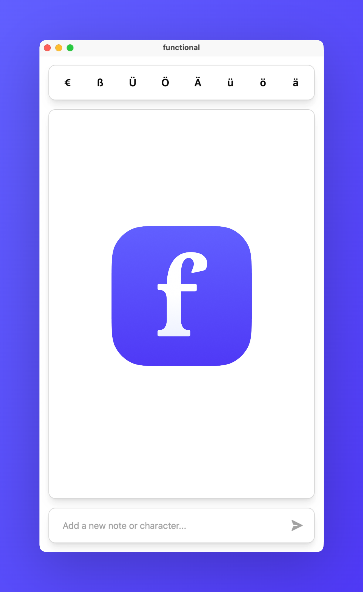

<p align="center"  width="100%">
    
</p>

# **functional**

A sleek, cross-platform note-taking app with a built-in special characters pane for quick copying of letters, symbols, and emojis.

## 🚀 Features

- Character Pane: Quickly access special letters (e.g., ä, ö, ü, ß) and emojis
- Rich Notes: Create, edit, and delete notes on the fly
- Clipboard: One-click copy of characters or full notes
- Cross-Platform: Runs natively on Windows, macOS, and Linux

## 🎬 Demo

<p align="center"  width="100%">
    
</p>

## ⚡️ Installation

1. Clone the repository
   ```bash
   git clone https://github.com/your-username/functional.git
   cd functional
   ```
1. Install dependencies
   ```bash
   npm install
   ```
1. Run in development mode
   ```bash
   npm run dev
   ```
1. Build for production
   ```bash
   npm run build
   npm start
   ```

## 🙌 Motivation

I live in Germany but use an English keyboard. Typing characters such as ä, ö, ü, or ß usually involves Windows' awkward character-picker. While tools like Microsoft PowerToys Quick Accent exist, I saw this as a chance to build a complete program from scratch and demonstrate my coding skills in a concise, self-contained project.

## ⚙️ Technologies used

- Electron - cross-platform desktop runtime
- TypeScript
- React + Tailwind CSS for the UI
- SQLite 3 for local data storage
- Vite and npm for tooling
- Microsoft Fluent System Icons
- Designs created in Figma

## 📄 License

This project is licensed under the MIT License — see the LICENSE file for details.
